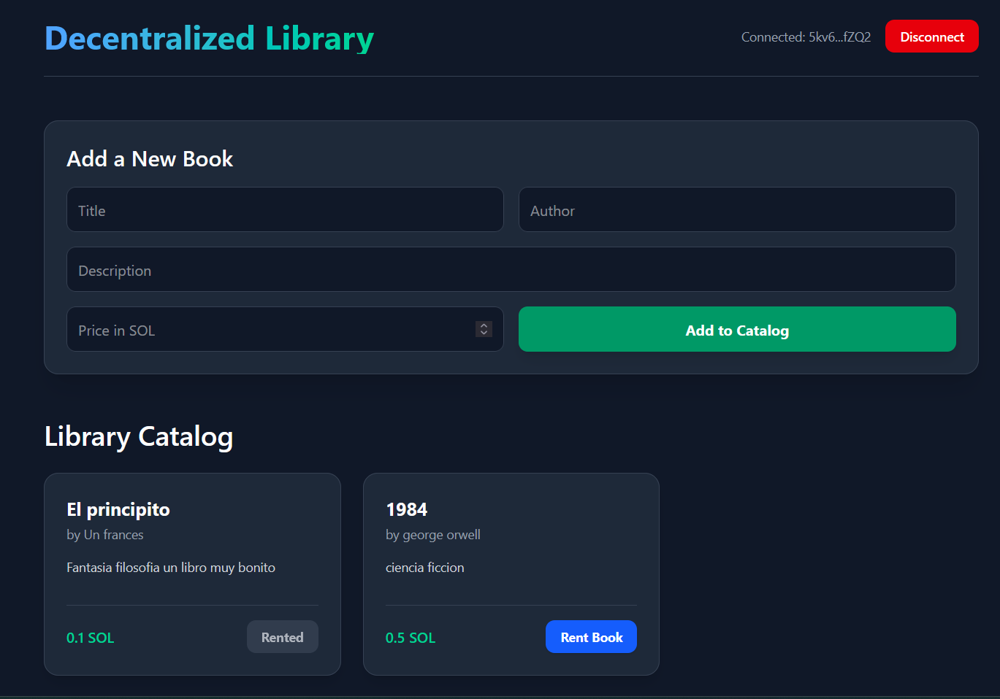

# Solana Decentralized Library

A full-stack, decentralized library system built on Solana. This platform allows users to browse a catalog of books, add new titles to the library, and rent them using SOL via an on-chain Anchor program.



## 🚀 Overview

The Decentralized Library bridges the gap between traditional Web2 databases and Web3 on-chain transactions. It uses:

- **Frontend**: Next.js 15, React 19, Tailwind CSS v4
- **Backend (Off-chain State)**: Prisma ORM with SQLite (using Better-SQLite3 driver adapters)
- **Smart Contracts (On-chain State)**: Solana program written in Rust using the Anchor framework

## `Program ID: 46Brqof8bysRqDbaYH1NTdYWfYP53zb1JfXPPX5nC1xL`

- **Web3 Integration**: `@solana/web3.js`, `@solana/react-hooks` for wallet connection, and native VersionedTransactions.

## ✨ Features

- **Wallet Connection**: Connect your favorite Solana wallet (Phantom, Solflare, Backpack) seamlessly.
- **Book Catalog Management**: Create new books storing metadata off-chain (Prisma/SQLite) to keep the application fast and cost-effective.
- **On-chain Rentals**: Rent books by invoking an Anchor smart contract, creating a unique Program Derived Address (PDA) for each rental record, and transferring SOL to a treasury.
- **Hybrid State**: After confirming the transaction on-chain, the backend marks the book as "RENTED" and stores the transaction signature.

---

## 🛠️ Prerequisites & Setup

To run this project locally, you will need:

- Node.js (v20+)
- Rust & Cargo
- Solana CLI
- Anchor CLI (`@coral-xyz/anchor` v0.30+)

### 1. Install Dependencies

Install the frontend and backend dependencies:

```bash
npm install
```

### 2. Database Setup

Initialize the Prisma SQLite database and push the schema:

```bash
npx prisma db push
```

### 3. Start the Development Server

Launch the Next.js application:

```bash
npm run dev
```

The app will be available at `http://localhost:3000`.

---

## 🧠 How it Works (Under the Hood)

The core architecture uses a **hybrid state model**. Heavy metadata (title, author, description) is stored off-chain in a relational database, while financial transactions and definitive rental proofs live on the Solana blockchain.

### 1. The Database Model (Prisma)

Books and Rentals are tracked in our SQLite database. When a book is rented, we record the user's public key and the Solana transaction signature.

```prisma
// prisma/schema.prisma
model Book {
  id          String   @id @default(cuid())
  title       String
  author      String
  description String
  priceSol    Float
  status      String   @default("AVAILABLE") // "AVAILABLE" or "RENTED"
  rentals     Rental[]
}
```

### 2. The Anchor Program (Smart Contract)

The Solana program contains an instruction to rent a book and transfer the exact `amount` in SOL from the user to the library treasury.

**Understanding PDAs (Program Derived Addresses)**  
To store the state of a rented book on-chain without needing a private key, the program creates a **PDA** (Program Derived Address). This PDA acts as a unique, deterministic account owned by the smart contract.

- The address is derived using specific seeds: `[b"rental", book_id.as_bytes()]`.
- By using the unique `book_id` as a seed, both the smart contract and the Next.js frontend can deterministically find the exact address for any given book's rental record.
- This guarantees that each book can have its own unique on-chain state account safely managed by the program, preventing unauthorized modifications.

```rust
// solana-programs/programs/solana-programs/src/instructions/rent_book.rs
pub fn rent_book(ctx: Context<RentBook>, book_id: String, amount: u64) -> Result<()> {
    let rental_record = &mut ctx.accounts.rental_record;

    rental_record.user = ctx.accounts.user.key();
    rental_record.book_id = book_id;
    rental_record.timestamp = Clock::get()?.unix_timestamp;
    rental_record.amount = amount;

    // Transfer SOL from user to treasury
    if amount > 0 {
        system_program::transfer(
            CpiContext::new(
                ctx.accounts.system_program.key(),
                system_program::Transfer {
                    from: ctx.accounts.user.to_account_info(),
                    to: ctx.accounts.treasury.to_account_info(),
                },
            ),
            amount,
        )?;
    }

    Ok(())
}
```

### 3. The Frontend Transaction (Next.js)

When a user clicks "Rent Book", the frontend builds a Solana `VersionedTransaction` and prompts the user's wallet to sign and send it. Once confirmed, it updates the off-chain database via a REST API.

```typescript
// app/page.tsx (Snippet)
// Step 1: Build the Anchor instruction
const instruction = await program.methods
  .rentBook(book.id, amount)
  .accounts({
    rentalRecord: rentalRecordPda,
    user: userPubkey,
    treasury: treasuryPubkey,
    systemProgram: SystemProgram.programId,
  })
  .instruction();

// Step 2: Compile to a VersionedTransaction
const message = new TransactionMessage({
  payerKey: userPubkey,
  recentBlockhash: blockhash,
  instructions: [instruction],
}).compileToV0Message();

const versionedTx = new VersionedTransaction(message);

// Step 3: Sign & broadcast via injected wallet provider
const result = await provider2.signAndSendTransaction(versionedTx);

// Step 4: Record in off-chain database
await fetch(`/api/books/${book.id}/rent`, {
  method: "POST",
  body: JSON.stringify({ userPubkey: address, txSignature: result.signature }),
});
```

## 🤝 Contributing

Contributions are welcome! If you'd like to improve the smart contract or the frontend UI, feel free to fork the repository and submit a Pull Request.

## 📄 License

This project is open-source and available under the [MIT License](LICENSE).
